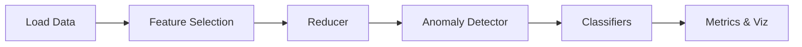
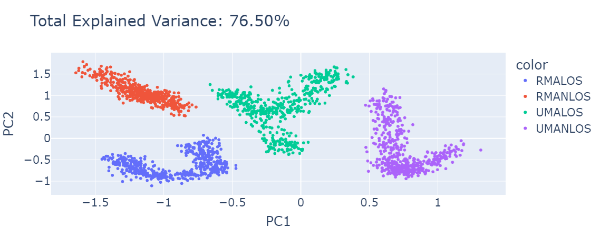
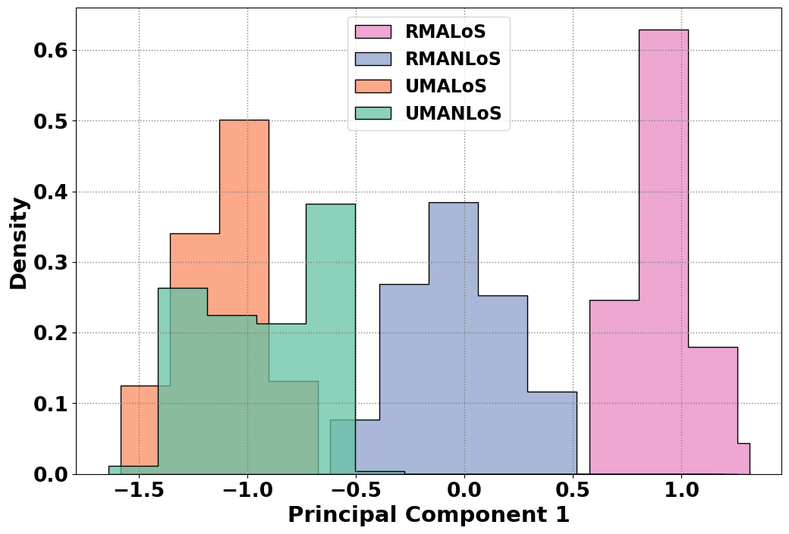

# Wireless Anomaly Detection

[](#)
[](#)
[](#)
[](#)
[](https://doi.org/10.17632/p4n85smvms.1)
[](LICENSE)

## Abstract
Modern wireless networks require scalable anomaly detection. This project
implements the framework described in *AI-Driven Anomaly Detection for Wireless
Networks*, combining Elastic Net feature selection, kernel-optimised PCA and
Isolation Forests. Key results include **76.5%** total explained variance and an
anomaly rate close to **5%** on the reference dataset.

## Architecture


## Quickstart
```bash
pip install -e .
wireless-anom run reduced --config src/wireless_anom/config/defaults.yaml
```

### Docker
```bash
make docker-build
make docker-run CMD="wireless-anom run reduced --config src/wireless_anom/config/defaults.yaml"
```

## Reproducing Paper Results
```bash
make reproduce
```
Generates all figures and tables under `outputs/`.

## Sample Outputs
| Scatter | Distributions |
| --- | --- |
|  |  |

### Classifier Accuracy

| Model | Accuracy |
| --- | --- |
| kNN | 1.00 |
| SVM | 1.00 |
| RF | 1.00 |
| DT | 1.00 |
| NB | 0.98 |

## Interpretability
- **TEV** shows variance captured per component.
- **Anomaly overlays** highlight Isolation Forest decisions.
- **Classifier tables** report accuracy per scenario.

## Extensibility
Add a new reducer by subclassing the base interface:
```python
from wireless_anom.reduce.base import Reducer

class MyReducer(Reducer):
    def fit_transform(self, X):
        ...
```
Register the reducer in the config and call via the CLI.

## Citation
Please cite the accompanying research article. See `CITATION.cff` for
bibliographic details.

## License
Code is licensed under MIT; documentation and dataset notes are CC BY-4.0.