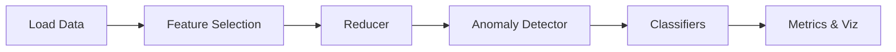

# Wireless Anomaly Detection
PLEASE CITE MY PUBLISHED PAPER: Métwalli, A., Badawi, W.K. AI-driven anomaly detection for wireless networks: a scalable and efficient approach using optimized kernel PCA and isolation forest. Wireless Netw (2026). https://doi.org/10.1007/s11276-026-04125-3
[](#)
[](#)
[](#)
[](https://doi.org/10.17632/p4n85smvms.1)
[](LICENSE)

## Abstract
Modern wireless networks require scalable anomaly detection. This project
provides the reference implementation for the paper
[*AI-Driven Anomaly Detection for Wireless Networks*](https://doi.org/10.17632/p4n85smvms.1).
It combines Elastic Net feature selection, kernel-optimised PCA and Isolation
Forests, yielding **76.5%** total explained variance and an anomaly rate close
to **5%** on the reference dataset.
Zenodo DOI: 10.5281/zenodo.17096385

## Table of Contents
- [Architecture](#architecture)
- [Getting Started](#getting-started)
- [Docker](#docker)
- [Pipeline](#pipeline)
- [Data](#data)
- [Reproducing Paper Results](#reproducing-paper-results)
- [Sample Outputs](#sample-outputs)
- [Interpretability](#interpretability)
- [Extensibility](#extensibility)
- [API](#api)
- [Roadmap](#roadmap)
- [Changelog](#changelog)
- [Code of Conduct](#code-of-conduct)
- [Contributing](#contributing)
- [Security](#security)
- [Citation](#citation)
- [License](#license)

## Architecture


## Getting Started
```bash
pip install -e .
wireless-anom run reduced --config src/wireless_anom/config/defaults.yaml
```

### Docker
```bash
make docker-build
make docker-run CMD="wireless-anom run reduced --config src/wireless_anom/config/defaults.yaml"
```

## Reproducing Paper Results
```bash
make reproduce
```
Generates all figures and tables under `outputs/`.

Individual figures can be generated via the CLI:

```bash
wireless-anom viz figures --config src/wireless_anom/config/defaults.yaml
```

## Pipeline
1. **Load** reduced or raw features via flexible loaders.
2. **Feature selection** using Elastic Net when raw features are available.
3. **Reduce** dimensionality with pluggable reducers (PCA, KPCA, UMAP stub).
4. **Detect** anomalies globally with Isolation Forest and optionally validate
   locally with DBSCAN.
5. **Classify** scenarios with a suite of supervised models.
6. **Evaluate** using total explained variance and clustering indices.
7. **Visualise** distributions, anomaly scatter plots, TEV contributions and
   confusion matrices.

## Data
The Mendeley dataset
[10.17632/p4n85smvms.1](https://doi.org/10.17632/p4n85smvms.1) contains reduced
KPCA components and labels. Place downloads under `data/external/` and configure
the path accordingly. Raw data belongs in `data/raw`, processed sets in
`data/processed`.

## Sample Outputs
| Scatter | Distributions |
| --- | --- |
|  |  |

### Classifier Accuracy

| Model | Accuracy |
| --- | --- |
| kNN | 1.00 |
| SVM | 1.00 |
| RF | 1.00 |
| DT | 1.00 |
| NB | 0.98 |

## Interpretability
- **TEV curves** indicate how much variance each component captures.
- **Anomaly overlays** show where Isolation Forest flags outliers on the
  PC1/PC2 plane.
- **Confusion matrices** summarise classifier performance and reveal
  misclassifications.

## Extensibility
Add a new reducer by subclassing the base interface:
```python
from wireless_anom.reduce.base import Reducer

class MyReducer(Reducer):
    def fit_transform(self, X):
        ...
```
Register the reducer in the config and call via the CLI.

## API
The `wireless_anom.pipeline` module exposes the main pipeline interface used
throughout the project.

## Roadmap
Planned enhancements include:

- UMAP and t-SNE reducers.
- Additional anomaly detectors such as Local Outlier Factor and One-Class SVM.
- Expanded kernel strategies for KPCA.

## Changelog
### 0.1.0
- Initial scaffolding.

## Code of Conduct
Be respectful and considerate.

## Contributing
Please open issues and pull requests. Run tests before submitting.

## Security
For security issues, please email ametwalli@aast.edu

## Citation
Please cite the accompanying research paper when using this software.
Bibliographic information is provided in `CITATION.cff`.

## License
Code is licensed under MIT; documentation and dataset notes are CC BY-4.0.
